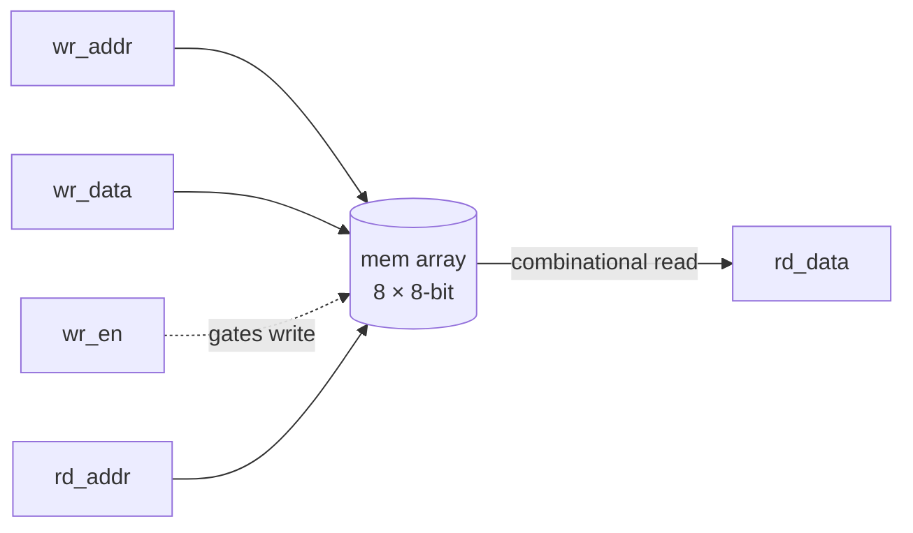
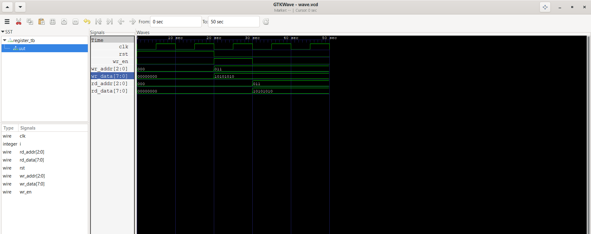

# 8-BIT-REGISTER-MEMORY

A small single-write-port, single-read-port register file — 8 entries × 8 bits — written in synthesizable Verilog. Verified in simulation with Icarus Verilog + GTKWave.

## Features

- 8 × 8-bit register array (`mem[0:7]`, addressed by 3-bit `wr_addr`/`rd_addr`)
- Synchronous write (registered on `clk`, gated by `wr_en`)
- **Combinational (asynchronous) read** — `rd_data` reflects `mem[rd_addr]` immediately, with no read-clock latency
- Synchronous, active-high reset that clears all 8 entries in one cycle

## Architecture



This is a **register file**, not block RAM: the read path is a plain continuous assignment (`assign rd_data = mem[rd_addr]`), so on an FPGA this will synthesize as distributed logic / LUTRAM rather than a BRAM primitive. That's appropriate at this size (8 entries) but won't scale efficiently to larger memories — see [Limitations](#limitations--future-work).

## Port List

| Signal     | Direction | Width | Description                                   |
|------------|-----------|-------|--------------------------------------------------|
| `clk`      | input     | 1     | System clock                                      |
| `rst`      | input     | 1     | Synchronous, active-high reset — clears all 8 entries |
| `wr_en`    | input     | 1     | Write enable                                       |
| `wr_addr`  | input     | 3     | Write address (0–7)                                |
| `wr_data`  | input     | 8     | Data to write                                      |
| `rd_addr`  | input     | 3     | Read address (0–7)                                 |
| `rd_data`  | output    | 8     | Data at `mem[rd_addr]`, combinational              |

## Repository Structure

```
8-BIT-REGISTER-MEMORY/
├── rtl/
│   └── register.v
├── tb/
│   └── register_tb.v
├── waveform/
│   ├── registerwave.png
│   └── wave.vcd
├── .gitignore
├── LICENSE
└── README.md
```

## Getting Started

### Prerequisites
- [Icarus Verilog](http://iverilog.icarus.com/) (`iverilog`, `vvp`)
- [GTKWave](https://gtkwave.sourceforge.net/)

### Simulate

```bash
iverilog -o reg1_sim rtl/register.v tb/register_tb.v
vvp reg1_sim
gtkwave waveform/wave.vcd
```

## Simulation Results

The testbench writes `10101010` (0xAA) to address `3'b011`, then reads back from the same address. The waveform confirms `rd_data` correctly returns `10101010`:



## Limitations & Future Work

- **Testbench is not self-checking.** It applies one write/read pair and dumps a waveform for visual inspection; no `$display`-based PASS/FAIL comparison against an expected value.
- **Only one write/read address tested.** The stimulus never exercises other addresses, back-to-back writes to different locations, or a same-cycle write-then-read to the same address (write-through vs. old-data-first behavior isn't characterized).
- **Single read/write port.** No support for simultaneous reads from two addresses (true 2-read-port register file) or a second write port.
- **Reset loop won't scale.** The `for` loop that clears all 8 entries on reset is fine here, but if this is extended to a larger memory (e.g. 32 or 64 entries), an all-entries synchronous clear becomes expensive in LUTs/timing — worth revisiting if depth increases.
- **No FPGA synthesis results yet** — utilization and timing on real hardware, and confirming this maps to LUTRAM as expected, are natural next steps.

## License

Licensed under the MIT License — see [LICENSE](LICENSE) for details.
